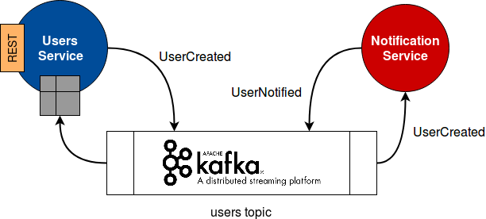

# Event driven microservices

This repo contains an example of how to build loosely coupled, event based microservices, 
using **Kafka** as the message broker.



The repository is organized in three modules:

- [schema](schema): contains the **event schema definitions** in Avro.
- [user-service](user-service): contains the **Users** microservice, which registers users in the system.
- [notification-service](notification-service): contains the **Notifications** microservice, which sends a notification to a Slack channel every time a user is registered.

## Running the example

### Start Kafka / Schema Registry

There is a docker-compose to start a local **Kafka** server with an **Schema Registry**. To start it:

```sh
docker-compose up
```

> *NOTE:* you need to add the following entry to the /etc/hosts in order to connect with Kafka: `127.0.0.1	kafka`

### Run the services

You can then run the services:

```sh
mvn package
mvn scala:run -pl user-service
mvn scala:run -pl notification-service
```

> *NOTE:* don't forget to configure the Slack Webhook in the `notification-service/src/main/resources/application.conf`.

### Create a user

```sh
curl localhost:8080/users -XPOST -d '{ 
    "id": 1,
    "firstName": "Mr.", 
    "lastName": "Meeseeks",
    "age": 2018,
    "email": "meeseeks@rick.me"
}'
```

### Check when the user is notified

```sh
curl localhost:8080/users/1
```
